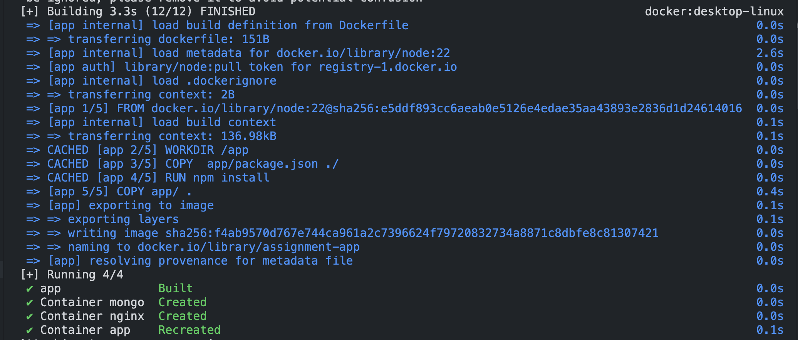
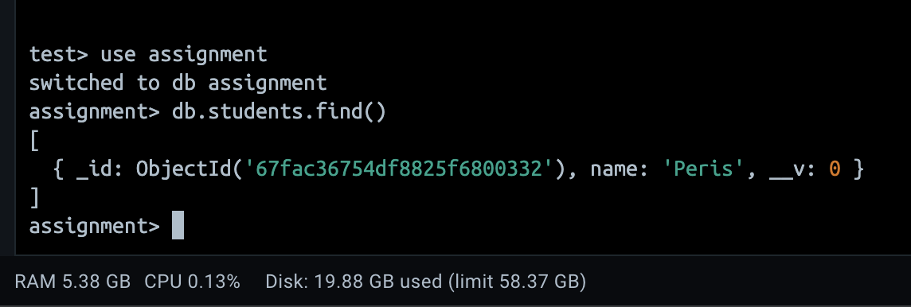
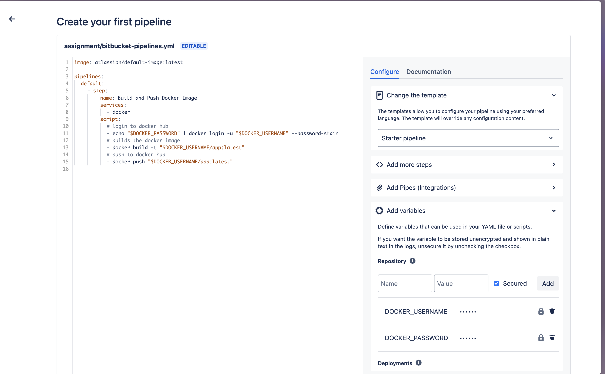

# Assignment

## Dockerization and mongodb backup

### Clone the project with

```
https://github.com/Peris-rana/assignment.git
```

### Create a .env file inside the app folder and add the following

```
MONGO_URL="your mongodb string"
```
but to add data inside your container you must use  the mongo service name
```
MONGO_URL=mongodb://mongo:27017/assignment
```

### Inside the assignment folder run this command

```bash
  docker compose up --build
```

### To run the back up script

- use chmod to change file permission

```
chmod 777 mongodb_backup.sh
```

- use ./ to run the file

```
./mongodb_backup.sh
```






## Bitbucket Pipelines & Docker Hub Deployment

- Push the pipeline file in the bitbucket repository.
- The bitbucket-pipelines.yml file should be in the root of the repository.
- Add the enviroment variables to the repository variables
```
repository settings  => pipelines => repository variables
```
- it automatically runs
###



